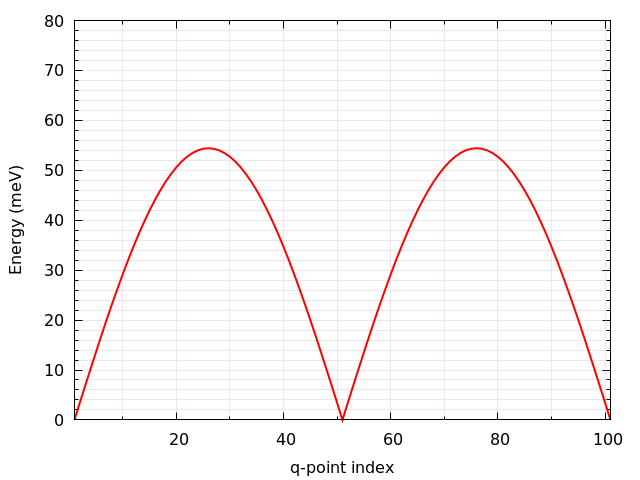
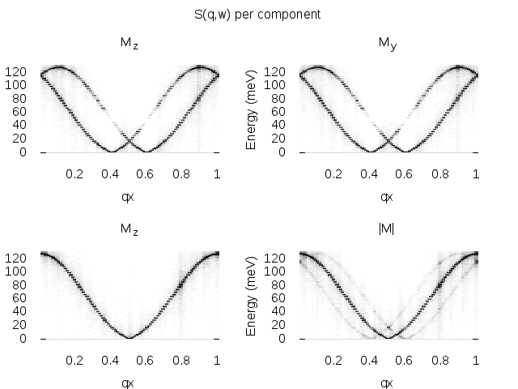

Tutorial
========

Some typical examples of simulations using the UppASD program are discussed here as a step-to-step tutorial.

Dynamics of a single spin
-------------------------

When treating magnetization dynamics the first example that comes to mind is an isolated spin interacting with a constant effective magnetic field. If the magnetic moment is not parallel to the field this will exert a torque and cause it to move. Due to the fact that in reality there are several channels of dissipation, the spin does not precess forever along the direction of the field (unless it is completely undamped) and after some time it reaches the equilibrium position, *i.e*. it will be aligned parallel to the effective field.

Situations such as this are at the core of spin dynamics simulations, that is one has one or more spins, and through some external perturbation, the system is driven out of equilibrium, causing it to evolve as given by the LLG equation, reaching the equilibrium position (at :math:`T=0\, \text{K}`) after a certain time which is determined by the Gilbert damping parameter, :math:`\alpha`.

In general when one is interested in seeing the relaxation dynamics of a given process the procedure is the following:

  - Run a spin dynamics simulation (``mode S``) with a suitable algorithm e.g. midpoint (``SDEAlgh 1``) for a given initial condition.
  - Collect the results and analyze the trajectories, averages and/or other dynamical quantities.
  - Determine the quantity of interest, e.g. relaxation time.

For the purpouses of this walkthrough, the input files for the single spin mode will be used, these files are found in the example directory under the name ``SingleSpin``.

First one must go to the root directory of the example::

  cd examples/SimpleSystems/SingleSpin

In this directory one can see that there is a folder called ``BASE`` as well as several bash scripts. At first we explore the input files, for this enter the ``BASE`` folder::

  cd BASE

In this folder there is a selection of files, the ``inpsd.dat`` file which is the main input file for UppASD, the files ``momfile`` for the magnitude and direction of the moments, ``posfile`` for the position of the magnetic moments in the unit cell, the ``kfile`` for the magnetocrystalline anisotropy and the ``jfile`` for the exchange interactions present in the system.

Opening the ``kfile`` one can see that there is a uniaxial anisotropy with an eaxy axis along the :math:`z` -direction, this is used to simulate the constant field of the example (a similar behaviour can be obtained with an external magnetic field, but for this example the anisotropy is used). One can then examine the exchange interactions in the system, by accessing the ``jfile`` in this tutorial, is the fact that the exchange energy is set to zero, the reason behind this is that one wishes to model either a single spin *i.e.* it does not interact with any other magnetic moments, or a macrospin, i.e. a large magnetic moment composed of many spins but whose internal dynamics are frozen.

Now, the relaxation dynamics of a magnetic moment are intrinsically dependent on the fields acting over it and the damping parameter. In this tutorial the field is fixed, so the *damping* is the quantity of interest, hence, one must open the ``inpsd.dat`` to see which value it has.

In the ``inpsd.dat`` one can see that a given initial angle has been given to the magnetic moments by using a global rotation ``roteul 1`` such that the spin and the easy axis have a :math:`30\deg` angle between them. The magnitude of the damping is set to a dummy variable ``GILBERT``, and the temperature has also been set to a dummy called ``TEMPE``, the actual magnitudes of these parameters will be set by the scripts.

To perform the actual calculations, one needs to go back to the parent directory and then first run the script ``SWEEP_DAMP.sh``::

  cd ../
  ./SWEEP_DAMP.sh

This script will run the ASD simulation for several values of the damping, which will be printed in the screen and will store all the files in folders named ``DAMP`` *value of damping*, while setting the temperature to :math:`T=0\,\text{K}`.

After having run the ``SWEEP_DAMP.sh`` file one can plot the relevant information using the ``plot.gnu`` script which will create a plot using ``gnuplot`` (these plots can be produced with other plotting programs making use of the ``averages.*.out`` files). To run the plotting one just needs to do::

  gnuplot plot.gnu

The script will produce a file named ``GilbertTotal.png``, opening this file one can see the following evolution of the different components of a magnetic moment interacting with the field created by a uniaxial anisotropy when different damping values are considered.

.. image:: images/GilbertTotal.png

As can be seen in this plot one has the time evolution of the different components of the magnetic moments. In general in the limit of low damping :math:`\alpha<1` one can see that as the damping increases the system reaches the equilibrium faster. It is of special interest to also look at the limit :math:`\alpha=0`, where one can see that without damping the spin will precess around the effective field without ever aligning itself with it, this is evident by looking at the time evolution of :math:`M_z`. However, in the high damping limit :math:`\alpha>1` as the damping increases the magnetic moment actually slows down, this is of great importance and it is the reason why Gilbert introduced the damping in a different way than Laundau and Lifshitz originally did, as the damping acts as a viscous force, and in the limit of infinite damping the speed of the spin motion goes to zero.

Switching under external magnetic field
^^^^^^^^^^^^^^^^^^^^^^^^^^^^^^^^^^^^^^^

Now that the effect of the damping on the dynamics is understood, another aspect of great relevance for magnetization dynamics can be studied, namely the switching of the magnetic moment under the influence of an external field. For this one can run the script ``SWEEP_FIELD.sh``::

  ./SWEEP_FIELD.sh

This will create a series of folders named ``FIELD`` *value of the field*, in each of these folders the temperature is set to :math:`T=0\,\textrm{K}`, and the damping is set to :math:`\alpha=0.1`. To observe the switching an external magnetic field is added in the following way::

  hfield   0.00  0.00  -hfield

that is, the external field is along the negative z-direction which will extert a torque over the magnetic field.

To study the effect that the external magnetic field has over the dynamics of the system lets use the script ``plotB.gnu``::

  gnuplot plotB.gnu

This produces a plot named ``Switching.png`` in it one can see the time evolution of the :math:`M_z` component for different magnitudes of the external magnetic field. In it one can see that after a certain critical value of the external magnetic field, the magnetic moment switches, going from tending to align itself to the possitive z-direction to the negative z-direction, i.e. using an external magnetic field one can switch the direction of the magnetic moment. The figure shows the time evolution of the :math:`M_z` component of the magnetic moment under the influence of an external magnetic field of different magnitudes.

.. image:: images/Switching.png

Thermal effects
^^^^^^^^^^^^^^^

Temperature is known to have great importance on the magnetic properties of materials, and henceforth in the dynamics of the magnetic moments. In this section of the tutorial the switching of a magnetic moment thanks to thermal fluctuations. This can be done by running the ``SWEEP_TEMP.sh`` script::

  ./SWEEP_TEMP.sh

The simulations that will be perfomed by this script are very similar to the previous ones, in this case one has a spin aligned along the positive z-direction with a magnetic easy axis along the z-direction. The damping for all these examples is set to :math:`\alpha=0.01` and the temperature is varied. An analysis of some of the key features of the influence of thermal fluctuations can be observed by using the plotting script ``plotTemp.gnu``, this script will generate a couple of plots. Hence one needs to run the script::

  gnuplot plotTemp.gnu

First lets study the one called ``singleTemp.png``, in which one can see how the spin tends to fluctuate between two orientations (:math:`+z` and :math:`-z`), this is due to the uniaxial anisotropy present in the system in conjuction with the thermal fluctuations, which allow the spin to overcome the energy barrier given by the anisotropy. The figure shows the time evolution of the :math:`M_z` component of a magnetic moment at :math:`T=4\,\textrm{K}`

.. image:: images/singleTemp.png

The next plot named ``relaxation.png`` is an average :math:`M_z` over 200 replicas of the (``Mensemble 200``) of the simulation which are then averaged over. In here one can see instead the average relaxation time of the spin, showing how it can vary with temperature, thus show casing the importance of averaging.

.. image:: images/relaxation.png

Determination of :math:`T_c` of a ferromagnetic material
--------------------------------------------------------

When one talks about a ferromagnetic material, one refers to a class of substances that have as a ground state (:math:`T=0\,\textrm{K}`) all its spins aligned in the same direction. As temperature increases disorder enters to the system until at a certain critical (Curie) temperature :math:`T_c`  the system has no net magnetization. The Curie temperature could be seen as the highest possible working temperature for the material and is of great importance for applications.

In this walkthrough we will use Monte Carlo simulations to determine the magnetization as function of temperature and from that the :math:`T_c`. Overall, the procedure is as follows:

  - Run Monte Carlo simulations using either Metropolis algorithm (``mode M``) or Heat bath algorithm (``mode H``) for a set of different temperatures.
  - Collect the results and analyse the temperature dependent magnetization and/or other thermodynamic properties
  - Determine :math:`T_c`

For this step-by-step walkthrough, we will use the input files for Fe as example that is found in the example directory.
First of all, standing in the root directory, navigate to the input files of Fe::

  cd examples/Fe

The program works in such a way that we need to repeat simulations for different temperatures. For the purpose, it is recommended to use a script that does simplify a lot of things but first we need to prepare the input files for that. We will create a "Base" directory where the raw input files are stored::

  mkdir Base ; mv * Base/

Next, we need to copy two run-scripts (``runme.sh`` and ``printM.sh``) that will run a set of simulations at different temperatures from the scripts-directory::

  cp ../scripts/runme.sh . ; cp ../scripts/printM.sh .

Before starting the run-scripts, the inpsd.dat file needs to be prepared in such a way that the temperature in both initial and measurement phase are set to *TEMP*. Using any editor of choice, change temperature from *300* to *TEMP* of lines 25 and 28. With that, everything is prepared to run the simulations using the run-script::

  ./runme.sh

Depending on computer system, it may take some time to run through all temperatures. After all calculations are finished, a new directory for each temperature has been created with output files for that particular temperature. To create a summary, we are using the other script (printM.sh) that reads certain information in output files and collect them in a single file (thermal.dat) using the command::

  ./printM.sh

Let's investigate the generated thermal.dat::

  # Temp.   Mavg     UBinder    Susc.      Cv
      10  2.237941  0.666667  0.000007  1.021710
     100  2.164441  0.666664  0.000071  0.976500
     200  2.078111  0.666654  0.000166  1.024818
     300  1.986299  0.666631  0.000275  1.048131
     400  1.886474  0.666586  0.000422  1.079090
     500  1.777491  0.666515  0.000563  1.172849
     600  1.650539  0.666357  0.000827  1.277333
     700  1.504614  0.666068  0.001138  1.492052
     800  1.308315  0.665102  0.001981  1.770288
     900  1.007354  0.658843  0.005374  2.151073
     950  0.749161  0.635858  0.012374  2.260679
    1000  0.415532  0.542287  0.015266  1.487550
    1050  0.267658  0.473693  0.008910  1.004156
    1100  0.204595  0.442776  0.005369  0.784146
    1150  0.171373  0.429213  0.003673  0.670025
    1200  0.151207  0.444319  0.002641  0.556371
    1250  0.137225  0.455091  0.002093  0.471770
    1300  0.128381  0.431053  0.001813  0.418473
    1500  0.102811  0.464573  0.000898  0.283877

The contents of the file are as follows: first column list the temperature, magnetization (in Bohr) in the second column, the Binder cumulant (see below) in the third column, the susceptibility are found in the fourth columns and the fifth column contains the specific heat (in units of :math:`k_B`). If the magnetization (col 1) is plotted against the temperature (col 1) we immediately see that :math:`T_c` is around 1000 K. That is also reflected in the peak of the susceptibility (col 4) and the specific heat (col 5) around that temperature. However, in order to obtain a more precise value of :math:`T_c`, the cumulant crossing method that originally was suggested by Binder is very powerful and useful technique. The (4'th order) cumulant :math:`U_L` , defined as

.. math::

  U_L = 1 -\frac{\langle M^4 \rangle}{3 \langle M^2 \rangle ^2 }

has unique properties that makes it easy to locate :math:`T_c` without resorting to advanced finite size scaling analysis or calculation of critical exponents of the transition. As the system approaches infinite size, :math:`U_4 \to 4/9` for :math:`T> T_c` and :math:`U_4 \to 2/3` for :math:`T< T_c`. However, the crucial part is for large enough systems, the curves of :math:`U_4` for different lattice sizes cross in a fixed point :math:`U^*` and the location of the fixed point is :math:`T_c`. Practically, that means that all simulations are repeated using some other lattice size of the simulation box. As an example, change the ncell keyword in the inpsd.dat file (line 2) in the Base directory from using a cube of size 12 to 20 (i.e. 20 20 20) and repeat the calculations once again using the runme.sh script. Since the simulation box is now larger, it will take longer time to finish (with all other parameters fixed, the simulation time scales linearly with number of atoms in the cell, i.e. :math:`(20/12)^3 \approx 4.6` longer execution time than previous). Once finished, gather and collect the output using the printM.sh script. Now plot the cumulant as function of temperature. There are some statistical noise at high temperatures which can be reduced by running the simulations with more steps and more ensembles. Nevertheless, there is a distinct crossing around 955 K which is the calculated :math:`T_c` for the specific system.

(left) Cumulant of Fe as function of temperature using cubic simulation box of size L=12 and L=20. (right) Zoom in of the crossing point and the location of :math:`T_c`.

.. image:: images/MTFe2.png

Dynamical correlations and magnon spectra
-----------------------------------------

A very useful functionality of UppASD is the possibility to simulate the dispersion relations for magnons. This is done by sampling the dynamical structure factor :math:`S(\mathbf{q},\omega)` . The simulated magnon dispersion relations, or magnon spectrum, can straightforwardly be compared with experimental inelastic scattering measurements as a benchmark of the theoretical model.

Ferromagnetic magnons
^^^^^^^^^^^^^^^^^^^^^

In this tutorial we will show how to obtain the magnon spectra from ASD simulations of :math:`S(\mathbf{q},\omega)` as well as from linear spin wave theory, which gives the zero-temperature adiabatic magnon spectra of the same Hamiltonian used for the ASD simulations. The tutorial uses the simple example of a 1d-Heisenberg spin chain found among the examples provided with the UppASD distribution::

  cd examples/SimpleSystems/HeisChain

There, the input file ``inpsd.dat`` can be inspected and the following lines controls the sampling of the correlation function::

  do_sc Q
  sc_window_fun  2
  do_sc_local_axis N
  sc_local_axis_mix  0.0

  sc_nstep 2000
  sc_step 10

  qpoints F
  qfile   ./qfile

Checking the given parameters with their description in the section on input paramters, we see that here the sampling will be performed with a Hann windowing function, without transforming the system to a local reference frame, and with q-points given by the external file ``qfile``. Simulating the system as-is gives a magnon spectrum that looks as the left panel of the figure. In order to visualize the magnon spectrum, scripts are provided both for *Gnuplot* and for *MATLAB/Octave*. The plot in the figure was obtained by running the script ``Sqw/sqw_map.sh``. In the figures is shown (left) simulated magnon spectrum for a ferromagnetic Heisenberg spin chain and (right) adiabatic magnon spectum for the same system.

In order to get a feeling of which parameters that determine the range and quality of the simulated spectra, it is recommended to change the values of ``sc_step``, ``sc_nstep``, ``sc_window_fun``, and ``do_sc_local_axis``. Other general simulation parameters that also affects the :math:`S(\mathbf{q},\omega)` are also ``timestep`` and ``damping``. Since the simulation window (in the frequency domain) is determined by ``timestep``, ``sc_step``, and ``sc_nstep``, these parameters can be varied to get as efficient sampling as possible. As an example, a weakly coupled system have low-lying excitations and sampling these takes longer time than high-energy magnons. This can then be achieved by increasing ``sc_step`` but in these cases it is often possible to increase ``timestep`` as well, as the effective magnetic field, and the resulting torques results in slower precessions of the system and thus a coarser timestep can work. This always has to be tested carefully. The damping strongly affects the magnon spectrum and if a very clean signal is wanted, for careful identification of the magnon energies, then ``damping`` can be put to a value much lower than what is realistic (i.e. :math:`10^-5`).

An adiabatic magnon spectrum (AMS) can also be obtained by UppASD, in that case put the parameter ``do_ams y`` and provide a ``qfile`` as for the :math:`S(\mathbf{q},\omega)` simulations. The AMS can conveniently be ran at the same run as :math:`S(\mathbf{q},\omega)` so that the two different approaches can be compared to each other. By definition, the agreement should be good, and if the two approaches give varying result for a system with low damping and close to zero temperature, then that is a strong indication that either the system is not ferromagnetic or that it might not have been correctly set up. An example of the AMS for the Heisenberg chain is shown in the right panel of the figure. Thanks to the simplicity of this 1d nearest-neighbour model, the AMS can be derived by hand and compared with the simulated results, which is left as an exercise for the reader.

Magnons in antiferromagnets and spin spirals
^^^^^^^^^^^^^^^^^^^^^^^^^^^^^^^^^^^^^^^^^^^^

Since the simulated :math:`S(\mathbf{q},\omega)` only depend on the configurations and trajectories of the simulated magnetic moments, it is not restricted to ferromagnetic systems. Although non-ferromagnetic systems typically needs to be treated a bit more carefully than ferromagnets, it is still possible to obtain magnon spectra for such systems as well. This can be illustrated by running the provided examples *HeisChainAF* which has anti-feromagnetic exchange interactions, and *HeisChainDM* which has ferromagnetic interactions but also competing Dzyaloshinskii-Moriya interactions, and compare the output with the previously simulated ferromagnetic Heisenberg chain. Starting with the anti-ferromagnetic system *HeisChainAF*, running it the same way as the *HeisChain* example should give the following outputs.

(Left) Simulated magnon spectrum for an anti-ferromagnetic Heisenberg spin chain. (Right) Adiabatic magnon spectum for the same system.

Here one can notice the linear dispersion of magnon energies close to the :math:`\Gamma` -point which is always obtained for anti-ferromagnets.

In the *HeisChainDM* example, the competition between Heisenberg and Dzyaloshinskii-Moriya exchange results in a helical spin spiral with a pitch-vector along :math:`\hat{z}` and the moments rotate in the :math:`\hat{x}\hat{y}`-plane. The corresponding magnon spectrum is shown in the figure where it can be noticed that the minimum energy is not found for the :math:`\Gamma` -point but for the q-point :math:`q_0` corresponding to the wave-vector of the resulting spin spiral. It can also be seen that the agreement between the AMS and :math:`S(\mathbf{q},\omega)` is good but not perfect here. This highlights the important fact that the AMS currently does not have a general support for treating DMI interactions and while it can be expected to perform well for co-planar spin spirals, as found in this case, it should be handled with care. It can also be noted that the AMS only picks up one of the two non-degenerate magnon branches while both :math:`q^+_0` and :math:`q^-_0` are sampled by the :math:`S(\mathbf{q},\omega)`.

For spin spiral systems, the magnon dispersions do not behave as they in collinear systems. Instead there is a much stronger variation of the dispersion relations depending on which axis the excitations are sampled along. This can be observed by changing the ``do_sc_local_axis`` parameter and compare the simulated spectra. Also, running the *sqw_map.sh* post-processing script creates a combined figure of the magnon spectra along all cartesian/local axes in the file ``sqw_parts.png`` which is plotted for this system in the right panel of the figure.

(Left) Simulated magnon spectrum for a Heisenberg spin chain with DM interactions along with the corresponding AMS. (Right) Projections of :math:`S(\mathbf{q},\omega)` to the cartesian components :math:`S^\alpha` and the total magnitude :math:`|S|` for the same system.

